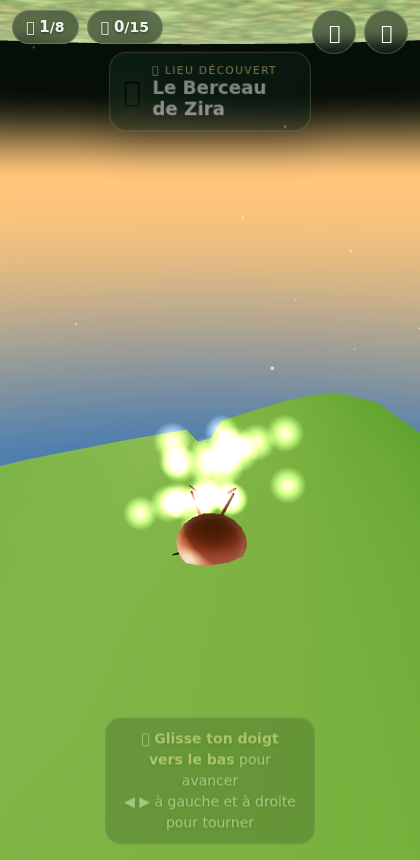
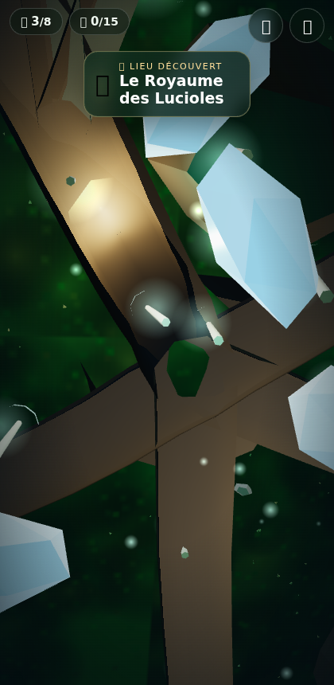

# 🐜 Zira et le Grand Arbre

Un **jeu web mobile 3D d'exploration et d'émerveillement** : tu incarnes **Zira**, une petite fourmi qui voyage dans un arbre immense — branches, feuilles, canopée dorée, champignons lumineux et racines profondes.

> Pas de combat, pas de chrono. Juste la beauté d'un monde à découvrir, comme une fourmi le voit.



## ✨ Ce qui t'attend

- **Un arbre procédural complet** : tronc, branches, brindilles, ~550 feuilles sur lesquelles Zira peut marcher, et un réseau de racines souterraines.
- **8 lieux merveilleux à découvrir** : le Berceau de Zira, le Jardin de Mousse, la Grande Feuille, le Pont de Brindilles, la Fleur de Rosée, la Canopée Dorée, le Royaume des Lucioles et la Racine Profonde.
- **15 gouttes de rosée** à collecter, qui font scintiller la feuille où elles reposent.
- **Un monde vivant** : lucioles, papillons, feuilles qui tombent, rayons de soleil dans la canopée, poussière dorée, herbe qui ondule, champignons et cristaux lumineux sous terre.
- **La feuille plie** sous les pattes de Zira quand elle marche dessus.
- **Une lanterne** s'allume automatiquement quand Zira descend sous terre.
- **Ambiance sonore 100 % synthétisée** (vent, oiseaux, gouttes d'eau souterraines, carillons de découverte) — aucun fichier audio.
- Ta progression est **sauvegardée** automatiquement sur ton appareil.



## 📱 Contrôles (tactiles)

| Geste | Effet |
|---|---|
| **Glisser vers le bas** | Zira avance |
| **Glisser vers le haut** | Zira recule |
| **Glisser à gauche / à droite** | Zira tourne |
| **Relâcher** | Zira s'arrête |
| **Double-tap** | Zoom caméra (près / loin) |

Au clavier (bureau) : flèches ou `ZQSD` / `WASD`, `Espace` pour le zoom.

Zira suit les branches et les feuilles comme une vraie fourmi : aux intersections, elle prend le chemin qui correspond à ton geste. En cul-de-sac (bout d'une feuille…), elle fait demi-tout toute seule.

## 🌐 Jouer

- **En ligne** : [GitHub Pages](https://moussadetous.github.io/Progr-s-arbre/) — fonctionne sur mobile et bureau.
- **Hors-ligne** : le site est une PWA (installable, joue sans réseau).
- **APK Android** : télécharge l'artefact `Zira-et-le-Grand-Arbre-APK` depuis l'onglet [Actions](../../actions) (dernier build réussi), puis installe-le sur ton téléphone (autoriser les sources inconnues). Voir ci-dessous.

## 🤖 Construire l'APK (GitHub Actions)

À chaque `git push`, le workflow [APK Android](.github/workflows/build-apk.yml) :

1. prépare les fichiers web dans `www/`,
2. synchronise le projet Android (Capacitor),
3. compile un **APK debug signé** (installable directement),
4. publie l'APK en **artefact téléchargeable**.

Pour l'obtenir : onglet **Actions** → dernier workflow « APK Android » réussi → section **Artifacts** → `Zira-et-le-Grand-Arbre-APK`.

En local (Linux/macOS, JDK 21 + SDK Android requis) :

```bash
npm install
npm run www
npx cap sync android
cd android && ./gradlew assembleDebug
# → android/app/build/outputs/apk/debug/app-debug.apk
```

## 🛠️ Technique

- **three.js r160** (fourni dans `vendor/`, aucune dépendance au runtime).
- Génération **procédurale déterministe** de l'arbre (seed fixe) : tronc penché, branches récursives, pont de brindilles, racines.
- **Graphe de navigation** : la fourmi se déplace de nœud en nœud le long des branches et de la nervure des feuilles, avec interpolation des normales (elle reste « collée » à l'écorce, même à la verticale ou sous une feuille).
- Rendu optimisé mobile : écorce fusionnée en un seul maillage, feuilles/rosée/mousse/fleurs en `InstancedMesh`, **qualité adaptative** (résolution réduite si les FPS chutent).
- Audio WebAudio synthétisé, service worker pour le hors-ligne.

## 📁 Structure

```
index.html            # page du jeu (écran titre, HUD, journal)
src/                  # modules du jeu (arbre, fourmi, décor, audio…)
vendor/three.module.js
style.css
manifest.webmanifest  # PWA
sw.js                 # cache hors-ligne
android/              # projet Capacitor Android (APK)
scripts/build-www.js  # copie des fichiers vers www/
.github/workflows/    # Pages + APK
```

## 📜 Licence

MIT — voir [LICENSE](LICENSE).
